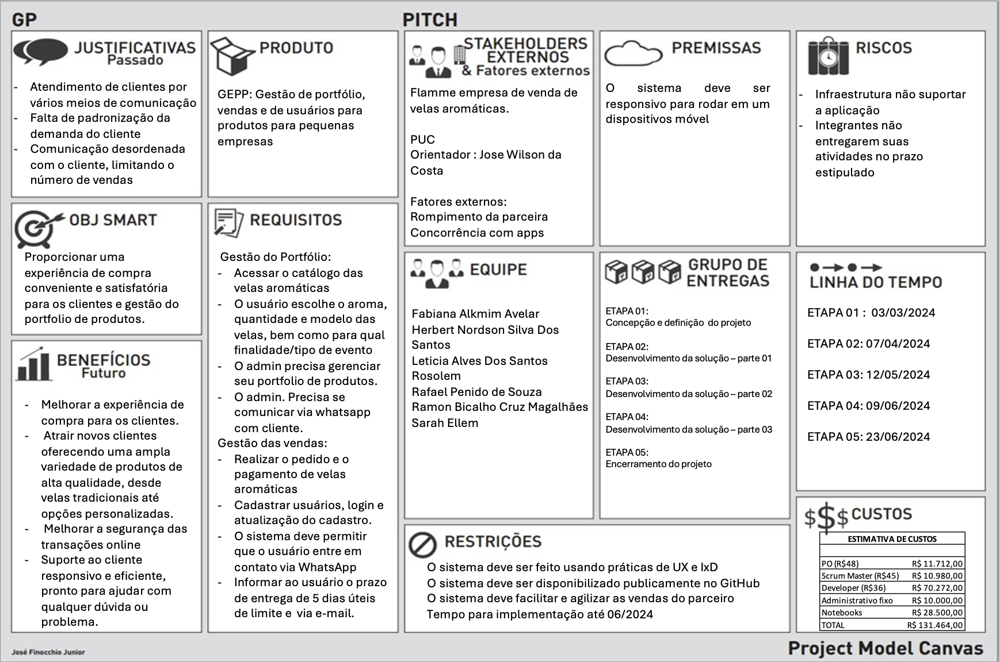
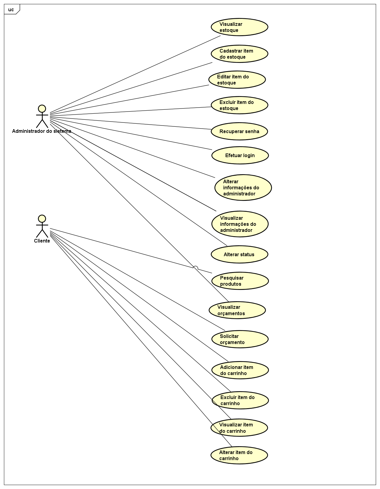
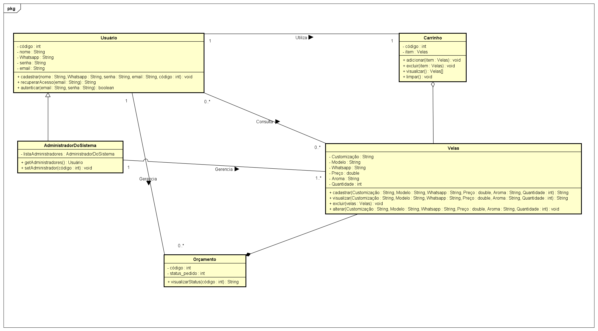

# Especificações do Projeto

## Project Model Canvas

## Requisitos

As tabelas que se seguem apresentam os requisitos funcionais e não funcionais que detalham o escopo do projeto. Para determinar a prioridade de requisitos, aplicar uma técnica de priorização de requisitos e detalhar como a técnica foi aplicada.

### Requisitos Funcionais

|ID    | Descrição do Requisito  | Prioridade |
|------|-----------------------------------------|----|
|RF-001 | O sistema deve permitir que o usuário tenha acesso ao catálogo das velas aromáticas | ALTA |
|RF-002 | O sistema deve ter instruções de funcionamento da venda e do envio das velas aromáticas | ALTA |
|RF-003| O sistema deve permitir que o usuário realize o orçamento/pedido de velas aromáticas | ALTA | 
|RF-004| O sistema deve permitir que o usuário escolha o aroma, quantidade e modelo das velas, bem como para qual finalidade/tipo de evento  | ALTA |
|RF-005| O sistema deve permitir que o usuário entre em contato de forma direta com o vendedor via WhatsApp a qualquer momento para sanar dúvidas | MÉDIA |
|RF-006| O sistema deve informar ao usuário o prazo de confecção do seu pedido de 5 dias úteis | MÉDIA |
|RF-007| O sistema deve redirecionar o usuário e o pedido já finalizado ao WhatsApp do vendedor  | ALTA |
|RF-008| O sistema deve permitir o login do administrador do sistema  | ALTA |
|RF-009| O sistema deve permitir a atualização dos dados do administrador do sistema | ALTA |
|RF-010| O sistema deve permitir que o administrador realize o gerenciamento das velas (CRUD)  | ALTA |
|RF-011| O sistema deve permitir que o administrador realize o gerenciamento dos orçamentos recebidos  | MÉDIA |
|RF-012| O sistema deve permitir que o administrador receba via WhatsApp o chat do cliente com o pedido já finalizado | ALTA |

### Requisitos não Funcionais

|ID     | Descrição do Requisito  |Prioridade |
|-------|-------------------------|----|
|RNF-001| O sistema deve ser feito usando práticas de UX e IxD | ALTA | 
|RNF-002| O sistema deve ser responsivo para rodar em um dispositivos móvel  | ALTA | 
|RNF-003| O sistema deve ser disponibilizado publicamente no GitHub |  ALTA | 
|RNF-004| O sistema deve facilitar e agilizar as vendas do parceiro |  ALTA | 

## Restrições

O projeto está restrito pelos itens apresentados na tabela a seguir.

|ID| Restrição                                             |
|--|-------------------------------------------------------|
|01| O projeto deverá ser entregue até o final do semestre |
|02| Deve ser desenvolvido um módulo de back-end |

## Diagrama de Casos de Uso

O diagrama de casos de uso é o próximo passo após a elicitação de requisitos, que utiliza um modelo gráfico e uma tabela com as descrições sucintas dos casos de uso e dos atores. Ele contempla a fronteira do sistema e o detalhamento dos requisitos funcionais com a indicação dos atores, casos de uso e seus relacionamentos. 

## Diagrama de Classes

O diagrama de classes ilustra graficamente como será a estrutura do software, e como cada uma das classes da sua estrutura estarão interligadas. Essas classes servem de modelo para materializar os objetos que executarão na memória.

## Modelo ER (Projeto Conceitual)

O Modelo ER representa através de um diagrama como as entidades (coisas, objetos) se relacionam entre si na aplicação interativa.

## Projeto da Base de Dados

O projeto da base de dados corresponde à representação das entidades e relacionamentos identificadas no Modelo ER, no formato de tabelas, com colunas e chaves primárias/estrangeiras necessárias para representar corretamente as restrições de integridade.

