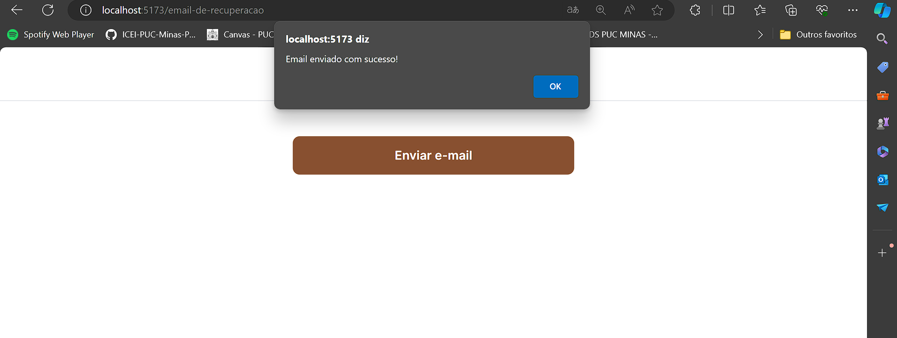

# Planos de Testes de Software

Apresente os cenários de testes utilizados na realização dos testes da sua aplicação. Escolha cenários de testes que demonstrem os requisitos sendo satisfeitos.

Enumere quais cenários de testes foram selecionados para teste. Neste tópico o grupo deve detalhar quais funcionalidades avaliadas, o grupo de usuários que foi escolhido para participar do teste e as ferramentas utilizadas.

| **Caso de Teste** 	| **CT-01 – Login do Administrador(a)** 	|
|:---:	|:---:	|
|	Requisito Associado 	| RF-008 – O sistema deve permitir o login do administrador do sistema|
| Objetivo do Teste 	| Verificar se o login está funcionando corretamente. |
| Passos 	| 1) Acessar o aplicativo “FLAMME” 2) Visualizar a página de Login, através de uma rota específica criada para a administradora 3) Inserir o e-mail e senha cadastrados no banco de dados para a administradora Marina obedecendo a LGPD 4) Ser redirecionado para a tela gestão de orçamentos/pedidos. |
| Critério de Êxito | - A tela de login deve abrir corretamente - O login e senha cadastrados devem direcionar o usuário para a tela de gestão de orçamentos/pedidos da FLAMME - Login e senha incorretos devem exibir uma mensagem de login ou senha incorretos. |
|  	|  	|

| **Caso de Teste** 	| **CT-02 – Esqueceu a senha / Recuperação de senha** 	|
|:---:	|:---:	|
|	Requisito Associado 	| RF-009 – O sistema deve permitir a atualização dos dados do administrador do sistema|
| Objetivo do Teste 	| Verificar se a alteração dos dados está ocorrendo corretamente. |
| Passos 	| 1) Acessar o aplicativo “FLAMME” 2) Clicar no botão esqueceu a senha 3) A administradora Marina será direcionada para a página de esqueceu a senha, digitará o e-mail para que possa acessar por caixa de entrada do e-mail ou um código de verificação via celular. Clicar no link presente a fim de ser redirecionada um e-mail com a senha para a cliente 7) Acessar o login novamente com a senha alterada. |
| Critério de Êxito | - O e-mail com a senha deverá ser recebido na caixa de entrada do cliente |
|  	|  	|

| **Caso de Teste** 	| **CT-03 – Informações do administrador(a)** 	|
|:---:	|:---:	|
|	Requisito Associado 	| RF-009 - O sistema deve permitir a atualização dos dados do administrador do sistema|
| Objetivo do Teste 	| Verificar se a alteração dos dados está ocorrendo corretamente. |
| Passos 	| 1) Acessar o aplicativo “FLAMME” 2) Visualizar a página de Login, através de uma rota específica criada para a administradora 3) Inserir o e-mail e senha cadastrados no banco de dados para a administradora Marina obedecendo a LGPD 4) Ser redirecionado para a tela gestão de orçamentos/pedidos. 5) Na tela de gestão de orçamentos/pedidos a administradora tem como navegar sobre os ícones de home /estoque /perfil /orçamentos/pedidos e irá clicar em “Perfil”. 6) A tela Perfil fornecerá um link para o campo de “informações de cadastro” 7) Tendo como função de alterar o nome, WhatsApp, e-mail, senha, já cadastrados no banco de dados para a administradora Marina obedecendo a LGPD. |
| Critério de Êxito | - Conforme a LGPD, se a administradora Marina possuir o nome, WhatsApp, e-mail ou senhas adulteradas a mesma pode recorrer do recurso de alterar as informações cadastrais pelo aplicativo FLAMME. |
|  	|  	|

| **Caso de Teste** 	| **CT-04 – Área do administrador(a)** 	|
|:---:	|:---:	|
|	Requisito Associado 	| RF-010 - O sistema deve permitir que o administrador realize o gerenciamento das velas (CRUD). RF-011 - O sistema deve permitir que o administrador realize o gerenciamento dos orçamentos recebidos. RF-012 - O sistema deve permitir que o administrador receba via WhatsApp o chat do cliente com o pedido já finalizado|
| Objetivo do Teste 	| Verificar se o administrador consegue fazer a gestão de estoque e confirmar se o orçamento seja excluído ou passe a ser um pedido no sistema. |
| Passos 	| 1) Acessar o aplicativo “FLAMME” 2) Visualizar a página de Login, através de uma rota específica criada para a administradora 3) Inserir o e-mail e senha cadastrados no banco de dados para a administradora Marina obedecendo a LGPD 4) Ser redirecionado para a tela gestão de orçamentos/pedidos 5) Gerenciar a parte de orçamentos/pedidos conforme já acordado pelo WhatsApp com o cliente 6) Clicar no ícone “Estoque” 7) Ser redirecionado para a tela Estoque em que ele poderá cadastrar, alterar, excluir ou editar os itens do produto. |
|Critério de Êxito | - A tela área da administradora deve abrir corretamente, Marina deverá conseguir alterar, cadastrar, excluir e editar os produtos do estoque, que deverão ser atualizados após salvar as informações. Além disso, possa excluir o orçamento, caso declinado pelo WhatsApp ou transformar o mesmo em pedido. |
|  	|  	|

| **Caso de Teste** 	| **CT-05 – Área do usuário** 	|
|:---:	|:---:	|
|	Requisito Associado 	| RF-001 –  O sistema deve permitir que o usuário tenha acesso ao catálogo das velas aromáticas. RF-002 - O sistema deve ter instruções de funcionamento da venda e do envio das velas aromáticas. RF- 003 - O sistema deve permitir que o usuário realize o orçamento/pedido de velas aromáticas. |
| Objetivo do Teste 	| Verificar se a área do usuário está apresentando as informações importantes, catálogo dos produtos e preenchimento/confirmação dos orçamentos corretamente. |
| Passos 	| 1) Acessar a página de home do aplicativo “FLAMME” 2) Na mesma contém todos os produtos oferecidos pela FLAMME 3) Na página de home, existe um campo “Clique aqui e veja como comprar” caso o cliente tenha o primeiro contato com o site e sendo redirecionado para informações importantes antes mesmo pedir um orçamento 4) Caso cliente clicar em um produto, será redirecionado a tela de produtos onde o mesmo deve escolher suas opções desejadas a partir do tipo customização achar pertinente 5) Após ter finalizado o orçamento o mesmo será encaminhado com seus dados preenchidos de endereço para o WhatsApp da administradora para acertar detalhes de prazos e fretes. |
|Critério de Êxito | - A tela home do usuário deve abrir corretamente – A partir dela, o usuário poderá visualizar informações importantes sobre a FLAMME, os catálogos de cada vela cadastrada no aplicativo, preencher a customização desejada, adicionar ao carrinho e finalizar o orçamento perfeitamente para encaminhar ao processo da administradora com o cliente para o fechamento do pedido via WhatsApp. |
|  	|  	|
 
# Evidências de Testes de Software

**CT-01 – Login do Administrador(a)**

Critério de êxito 01 - A tela de login deve abrir corretamente

Critério de êxito 02 - O login e senha cadastrados devem direcionar o usuário para a tela de gestão de orçamentos/pedidos da FLAMME

Backend - banco de dados do usuário

Critério de êxito 03 - Login e senha incorretos devem exibir uma mensagem de login ou senha incorretos

Mensagem de erro console

**CT-02 – Esqueceu a senha / Recuperação de senha** 

Critério de êxito 01 - A tela de login deve abrir corretamente, nela terá a opção esqueci a senha para a recuperação da senha

Critério de êxito 02 - A tela de recuperação de senha deve abrir corretamente

Critério de êxito 03 - Deverá aparecer uma mensagem informando que o e-mail foi enviado com sucesso

Critério de êxito 04 - O e-mail deverá ser recebido na caixa de entrada do cliente

Critério de êxito 05 - Erros ao longo do desenvolvimento

**CT-04 – Área do administrador(a)** 

Critério de êxito - A tela área da administradora deve abrir corretamente, Marina deverá conseguir alterar, cadastrar, excluir e editar os produtos do estoque, que deverão ser atualizados após salvar as informações. 

Criação de um novo produto

Preenchimento de dados

Ao clicar em Salvar inicia a requisição POST / CREATE

Requisição POST/CREATE com status 200

Resposta para a requisição POST/CREATE com status 200

GET - produtos na tela inicial "/"

Retorno das velas cadastradas

Ao clicar em "Editar" inicia um get pelo ID  do produto é apresentada a opção de alterar o nome do produto em tela.

GET produtos por ID, requisição

Retorno da requisição Get por ID

Ao adicionar um novo nome e clicar em alterar, aciona o UPDATE do produto.

Requisição update

Resultado do nome do produto alterado

Resposta da requisição após status 200

Ao clicar em "Excluir" aciona o DELETE

Requisição DELETE

Resposta da requisição para o status 200

Critério de êxito - A tela área da administradora deve abrir corretamente, Marina deverá conseguir visualizar os produtos do estoque.

**CT-03 – Informações do administrador(a)**

Critério de êxito - A tela área da administradora deve abrir corretamente, para que Marina consiga acessar a tela de Perfil.

**CT-05 – Área do usuário**

Critério de êxito - adicionar ao carrinho

